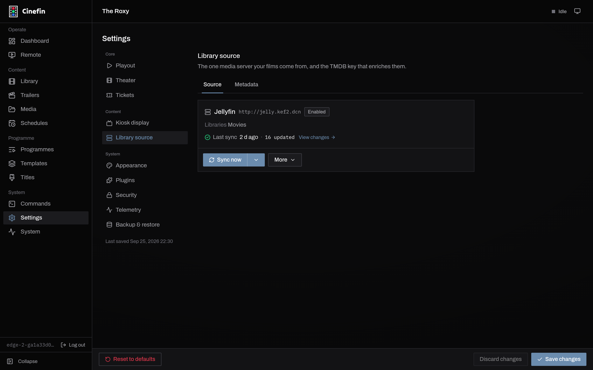
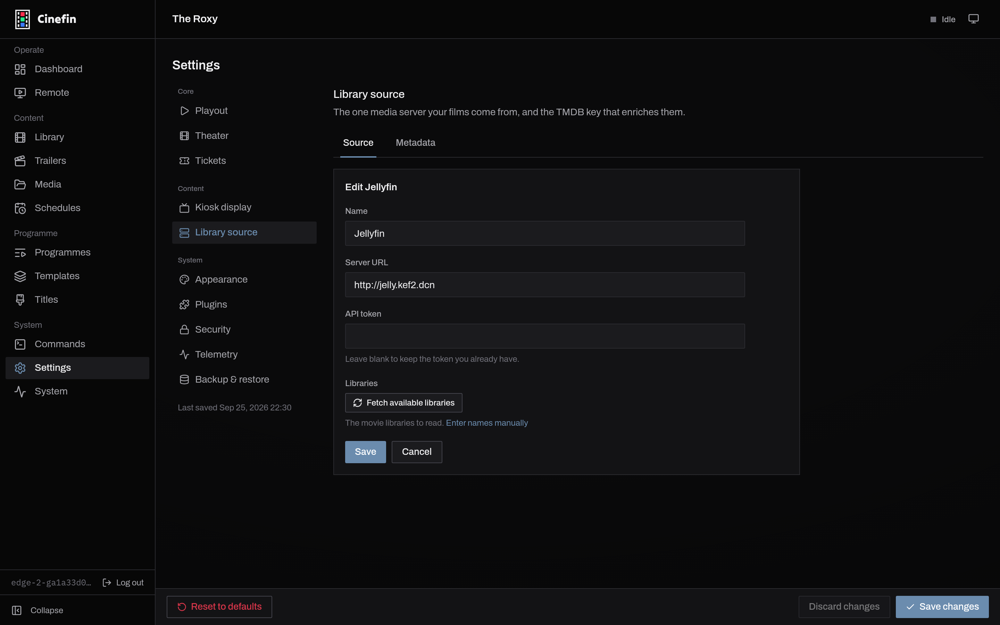
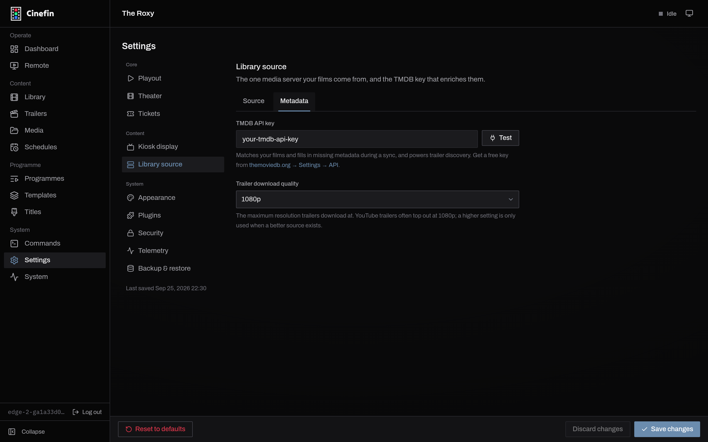

# Library sync

Cinefin keeps its movie list in step with your media server. Jellyfin and Plex
are both supported. You point Cinefin at one server, then sync whenever you want
new titles pulled in.

## Connect a source

A library reads from one media server. Open **Settings → Library source** and use
the **Source** tab.

<figure markdown="span">
  
  <figcaption>The Source tab, showing a connected server and its last sync.</figcaption>
</figure>

If nothing is connected yet, choose your server type and fill in the form. To
change an existing connection, open **More → Edit source**.

<figure markdown="span">
  
  <figcaption>Connecting a Jellyfin or Plex server.</figcaption>
</figure>

| Field | What it is |
| --- | --- |
| **Server URL** | Your server's address, port included, reachable from the machine running Cinefin, for example `http://living-room:32400`. |
| **API token** | The access token for your server. On an edit, leave it blank to keep the token you already have. |
| **Libraries** | The movie libraries to read. **Fetch available libraries** lists them from the server, or enter names by hand. |

## Run a sync

**Sync now** runs the source and streams progress and logs as it goes. Syncs are
incremental: films that have not changed on the server cost nothing to check, so
later runs are quick. When metadata or a file has changed and you want a full
reprocess, use **More → Full re-scan**. **View changes** shows what the last run
added, updated or removed.

Syncs run as background jobs and keep going across a restart. The other source
actions live under **More**: **Test connection**, **Find certificates** (below),
and **Remove source**.

## Certificates

**More → Find certificates** looks up age ratings for movies that have none yet,
from the rating scheme's site (BBFC via bbfc.co.uk, MPAA via filmratings.com).
This is what feeds the [certification cards](programmes.md) shown before a
feature. Choose which scheme Cinefin uses under **Settings → Theater**; trailers
are rated separately, from the **Trailers** page.

## Metadata and TMDB

The **Metadata** tab holds your **TMDB** key. TMDB matches your films and fills
in missing metadata during a sync, and it powers trailer discovery. A free key
from [themoviedb.org](https://www.themoviedb.org/) is enough. This tab also sets
the maximum trailer download quality.

<figure markdown="span">
  
  <figcaption>The TMDB key enriches films and powers trailer search.</figcaption>
</figure>

## Where the movies play from

A synced movie plays by streaming from Jellyfin or Plex over your network. A
movie you added on disk, or a server that is briefly offline, streams from
Cinefin itself. Cinefin picks the right source for each item when it builds a
playlist, so this is nothing you set up.

## Removing movies

A sync will not mass-delete your library by surprise. It matches on the server's
own item id and keeps guards against removing everything at once. Removing the
source itself leaves its films in your library; they stop being synced. If a
film that a programme uses later leaves your library, Cinefin flags it on the
programme rather than dropping it quietly.
