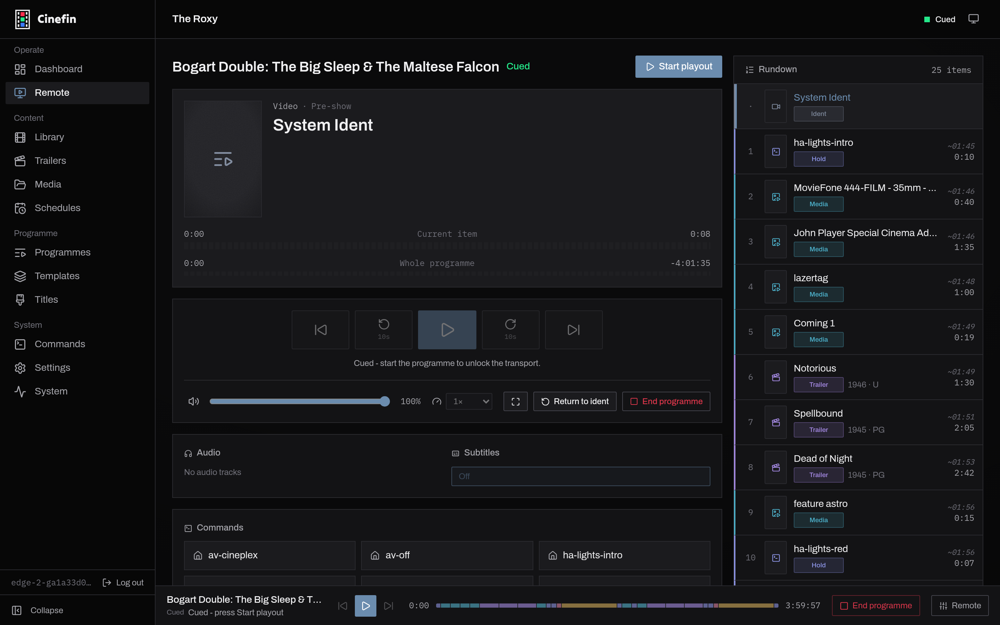

# Playback

import Tabs from '@theme/Tabs';
import TabItem from '@theme/TabItem';

Cinefin uses MPV for playback, and you choose between two ways to run it when you
add a playout host:

- **The playout agent (recommended).** A small program that runs MPV on the
  machine at your TV or projector. Cinefin owns the MPV process through it and
  sets the screen, resolution and audio from the web interface, and the two can
  run on different machines over a network.
- **A local MPV you run yourself.** Cinefin talks to it over a local JSON-IPC
  socket on the same machine. There is no process management or display setup
  from Cinefin; you run and configure MPV.

Both are set up the same way, under **Settings → Playout → Add host**.

## Set up a player

<Tabs>
<TabItem value="playout-agent-recommended" label="Playout agent (recommended)" default>

The agent is available here:
[cinefin-playout](https://github.com/cinefin/cinefin-playout). It is a
single, self-contained Go binary.

1. Download the archive from the project's
   [releases](https://github.com/cinefin/cinefin-playout/releases). Releases
   ship a **Linux amd64** archive in two forms: the plain archive bundles
   MPV, so you don't need to install it separately, and the `-nompv` archive
   is the agent binary alone, for when you want to use your own MPV. Keep the
   bundled `mpv` file next to `cinefin-playout`.

    :::note[Windows]

    A Windows amd64 build (also plain / `-nompv`) exists but is
    **experimental** and published only on the `edge` channel.

    :::

2. Unzip it and run it. The one binary shows a system-tray icon when run
   interactively (`./cinefin-playout` on Linux), and runs headless when
   started with `--no-ui`.
3. On first run the agent generates an access token. From the tray menu
   choose **Open control panel** to see the host address and token with copy
   buttons (it opens the loopback-only status page at `/ui`), or use **Copy
   address** / **Copy token**. With no tray, the token is printed to the log
   and saved to `<state_dir>/token`. The agent listens on port `8089` by
   default.
4. In Cinefin, open **Settings → Playout → Add host**, choose the **Playout
   agent (WebSocket)** type, paste the address and token, and choose **Use**.

With an agent host active, set the screen, resolution and audio device from
Cinefin itself under **Settings → Playout → Display & audio**. Cinefin reads
the real device lists from the agent and writes the choices back to the
agent's `config.toml`, so the box still boots and shows the idle ident even
when Cinefin is offline. If playback is choppy on a small machine, try
hardware decoding there.

#### Config file

A config file is **optional** - with none, the agent runs on defaults and
generates a token on first run. Add a `config.toml` only to pin the bind
address, a fixed token, or the MPV binary. Copy the sample, edit it, and run
the agent against it:

```bash
sudo mkdir -p /etc/cinefin-playout
sudo cp config.example.toml /etc/cinefin-playout/config.toml
sudoedit /etc/cinefin-playout/config.toml
cinefin-playout --config /etc/cinefin-playout/config.toml
```

The agent searches for a config in this order: the `--config` flag,
`$CINEFIN_PLAYOUT_CONFIG`, `./config.toml`,
`~/.config/cinefin-playout/config.toml`, then `/etc/cinefin-playout/config.toml`.
Graphics and audio normally come from Cinefin, but the `[mpv.graphics]` and
`[mpv.audio]` sections let you set them by hand for an offline box (including
headless DRM/KMS and audio passthrough).

For a dedicated box that puts MPV straight on the display without a desktop
(DRM mode), make sure the agent user can reach the GPU:

```bash
sudo usermod -aG video,render "$USER"
```

Log out and back in after changing groups. To start the agent at boot,
install the sample systemd unit from the project's `etc/` directory and run
it headless with `--no-ui`:

```bash
sudo cp cinefin-playout mpv /usr/local/bin/
sudo cp etc/cinefin-playout.service.example /etc/systemd/system/cinefin-playout.service
sudoedit /etc/systemd/system/cinefin-playout.service   # set User= (and SupplementaryGroups for DRM)
sudo systemctl daemon-reload
sudo systemctl enable --now cinefin-playout.service
```

The agent owns and supervises MPV itself, so don't also run a standalone
MPV service alongside it.

#### Two machines

If the agent is on a different machine from Cinefin, set the streaming base
URL to Cinefin's address as seen from the playout machine, for example
`http://cinema.local:8000`. `localhost` only works when both run on one
machine. Idents, trailers, user media and title cards stream from Cinefin,
so this matters even when your features come from Jellyfin or Plex.

</TabItem>
<TabItem value="mpv-local-socket" label="MPV (local socket)">

If you already run MPV yourself, point Cinefin straight at it. This suits a
box where MPV lives on the same machine as the Cinefin server.

1. Start MPV with a JSON-IPC socket:

    ```bash
    mpv --idle --input-ipc-server=/tmp/mpvsocket
    ```

2. In Cinefin, open **Settings → Playout → Add host** and choose the **Local
   mpv (JSON-IPC socket)** type.
3. Enter the socket path you passed to MPV, for example `/tmp/mpvsocket`, and
   choose **Use**.

Cinefin connects to the socket and loads the idle ident. Because Cinefin
reaches MPV through a local Unix socket, the two must run on the same
machine - in Docker, share the socket with a volume mount. Cinefin cannot start or
stop this MPV or change its screen and audio; you manage the MPV process
yourself.

</TabItem>
</Tabs>

## Playout lifecycle

A programme moves through these states:

```
NOT_LOADED -> LOADED -> RUNNING -> PAUSED <-> RUNNING -> COMPLETED
```

Cue a programme to load it, then start playout. Cinefin steps through the
playlist and applies each block's settings as it goes.

## What's on screen between screenings

When nothing is playing, the screen doesn't go blank. It holds your **System
Ident**, the same clip that opens each programme. Set it under **Settings →
Playout → Player → Idle & ident**.

See **[System Ident](system-ident.md)** for how to choose and test it.

## The remote

The **Remote** page is the full control surface. It shows what is on screen, the
current item and whole-programme timers, and the resolved rundown down the side.
When no programme is loaded it reads "No programme loaded" - cue one from a
[programme's](programmes.md) page, or press **Start playout**.

<figure>
  
  <figcaption>The Remote page: transport, speed, tracks and manual commands.</figcaption>
</figure>

- **Transport** - previous, skip back, play/pause, restart item, and next.
- **Volume and speed** - a volume slider and speed presets from 0.5x to 2x, plus
  fullscreen and a **Stop** that ends the screening.
- **Tracks** - pick the audio and subtitle track for what is playing now.
- **Commands** - fire any configured [command](../reference/configuration.md)
  by hand: lights, projector input, AV power. Useful for testing, or driving the
  room mid-screening.

The **Technical info** panel at the foot exposes the raw player state for
troubleshooting.

## Audio and subtitles

Each block can pin an audio track and a subtitle track, set on the block in the
programme editor. A subtitled trailer can play with subtitles on while the
feature uses your usual audio. The Remote's **Tracks** controls override the
current item on the fly.

## Controls everywhere

The playout bar sits on every page with play, pause, skip, seek and volume - so
you never have to leave what you are doing to nudge a screening. The same
controls are on the Remote page and in the [REST API](../reference/api.md), so
home automation can drive them too.
