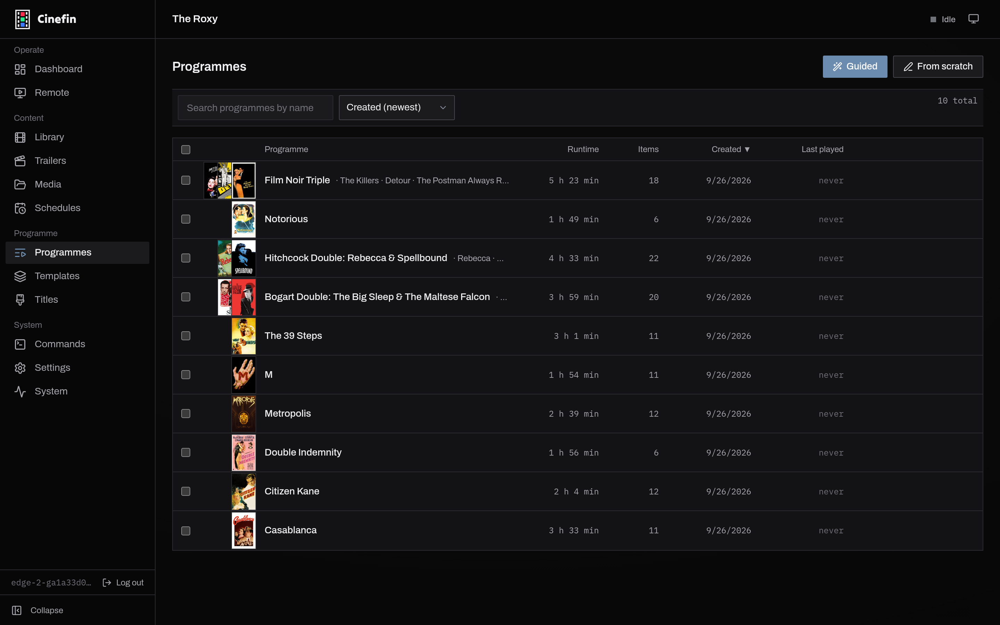
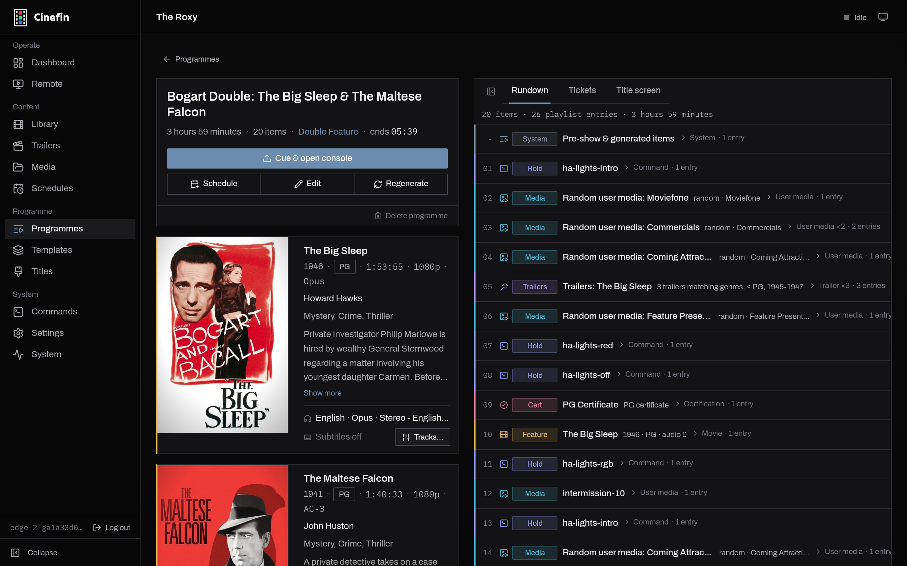
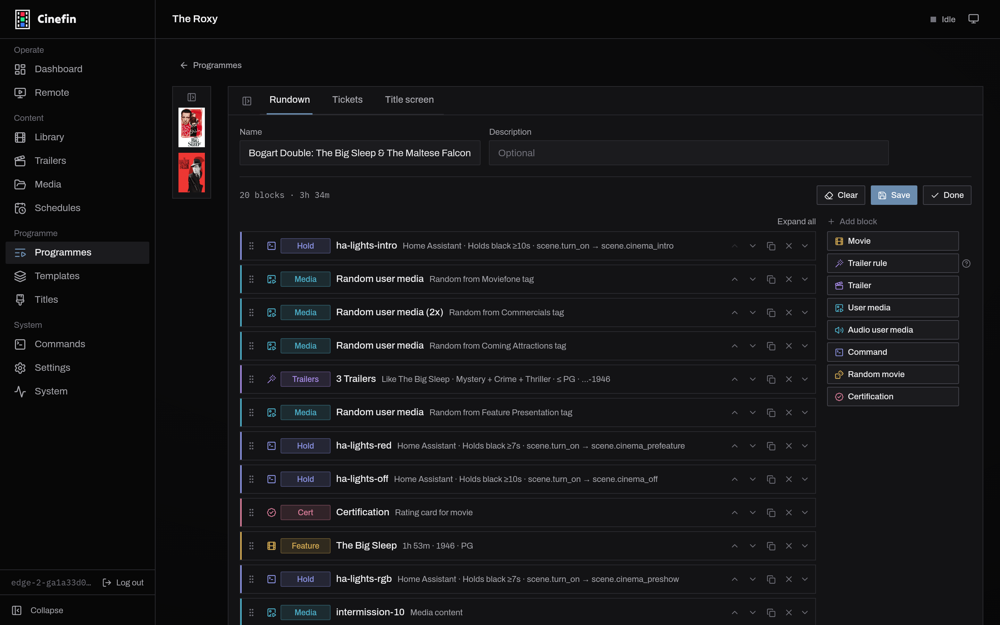

# Programmes

A programme is one complete screening: everything that plays from the moment the
lights dim to the end of the feature - idents, trailers, the certification card,
the feature itself, and any lighting or projector commands in between.

Programmes are almost always built from a [template](templates.md), which is the
reusable shape of a screening. The template does the arranging; the programme
turns it into real, fixed media for one showing.

## The programmes list

Open **Programmes** to see every screening you have built, with its runtime,
item count and when it last played.

<figure>
  
  <figcaption>Every built programme, newest first.</figcaption>
</figure>

Two ways to make one:

- **Create programme** - start from a template. Cinefin resolves the template's
  rules into concrete media for you. This is the usual route.
- **Build from scratch** - start with an empty running order and add every block
  yourself.

## Building from a template

Building a programme from a template turns every rule into real media:

- **Trailer rules** pick actual trailers that match the feature.
- **Random movie** and random **user media** blocks choose a specific film or clip.
- **Certification** and **title** cards are generated for the feature.

The result is a fixed **playlist** - what you see is exactly what will play.
Cinefin regenerates it whenever you change the programme, or you can force a
refresh with **Regenerate** (handy to reshuffle random picks).

## The rundown

A programme's detail page opens on the **Rundown**: the resolved playlist, block
by block, with a badge for each type (feature, trailer, user media,
certification, command, and so on) and how many playlist entries each block
produced.

<figure>
  
  <figcaption>The rundown shows every block resolved into playlist entries.</figcaption>
</figure>

If a film a programme relies on later leaves your library, Cinefin flags it here
rather than failing silently - the block is skipped at play time until you edit
the programme to replace it.

From this page you can **Cue &amp; open console** to load the programme and jump to
[playback](playback.mdx), **Schedule** it for a showtime (see
[scheduling](scheduling.md)), **Edit** it, **Regenerate** the playlist, or delete
it. The **Tickets** and **Title screen** tabs preview the printed ticket and the
generated title card.

## Editing blocks

**Edit** opens the block editor. Drag blocks by the grip handle to reorder them,
and use each block's controls to duplicate, remove, or move it. **Add block**
lists every block type:

<figure>
  
  <figcaption>Reorder by dragging; add blocks from the palette on the right.</figcaption>
</figure>

| Block | What it plays |
| --- | --- |
| Movie | A specific film from the library |
| Trailer rule | Trailers matched to the feature by genre, rating and year |
| Trailer | One specific trailer |
| User media | Your own clip, either a specific one or a random pick from a tag |
| Audio user media | A short intro matched to a feature's audio format (a Dolby or DTS sting) |
| Command | An action such as switching lights, run through Home Assistant, REST or a script |
| Random movie | A film picked when the programme is built, by genre, year or rating |
| Certification | The rating card for the feature, generated for you |

Expand a block to set its options: the tag a random clip is drawn from, whether
a command holds a black screen while it runs, the audio and subtitle tracks a
feature should use, and so on. **Save** keeps your changes and rebuilds the
playlist; **Done** returns to the rundown.

## Title and certification cards

A programme can open with a generated **title card** for the feature (poster,
title and showtime) in place of the usual ident. Cards are laid out by a title
template; assign one from the programme's **Title screen** tab. See
[templates](templates.md#title-templates).

**Certification cards** are built from the feature's rating. BBFC and MPAA are
both supported; choose your scheme in **Settings → Theater**, and fill missing
ratings with **More → Find certificates** on the library source (see
[Library sync](library-sync.md#certificates)).
