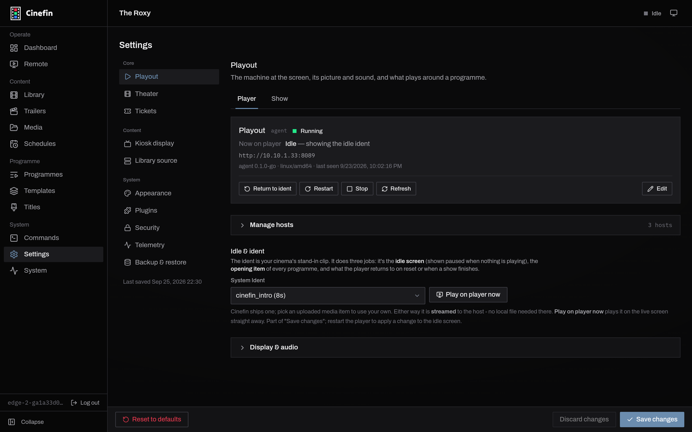

# System Ident

Between screenings the screen should show something other than a desktop or a
black void. Cinefin holds a single clip on screen whenever nothing is playing -
your theater's own ident - and plays that same clip to open every programme. One
clip, two jobs:

- **Idle screen** - shown paused whenever no programme is running, so the
  auditorium always carries your branding rather than a blank signal.
- **Opening item** - played when a programme starts, resets or finishes, so
  every screening begins the same way.

## Choose the clip

Set it under **Settings → Playout → Player → Idle & ident**. Pick any clip you
have uploaded to **Media**, or leave it on the built-in clip Cinefin ships.
**Play on player now** puts it on the live screen straight away, so you can check
it in the room.

<figure>
  
  <figcaption>The System Ident is set per playout host, in the Idle & ident section.</figcaption>
</figure>

The clip streams from Cinefin to the playout host, so there is no file to copy to
the playout machine (see [Playback](playback.mdx#set-up-a-player)). It saves with
the rest of the host's settings; because it is baked into the player's idle
state, restart the player to apply a change to the idle screen.

## Per host

The System Ident is part of a playout host's configuration, so each host can
carry its own. Switch the active host and its ident comes with it, which is handy
when a second screen wants different branding.
