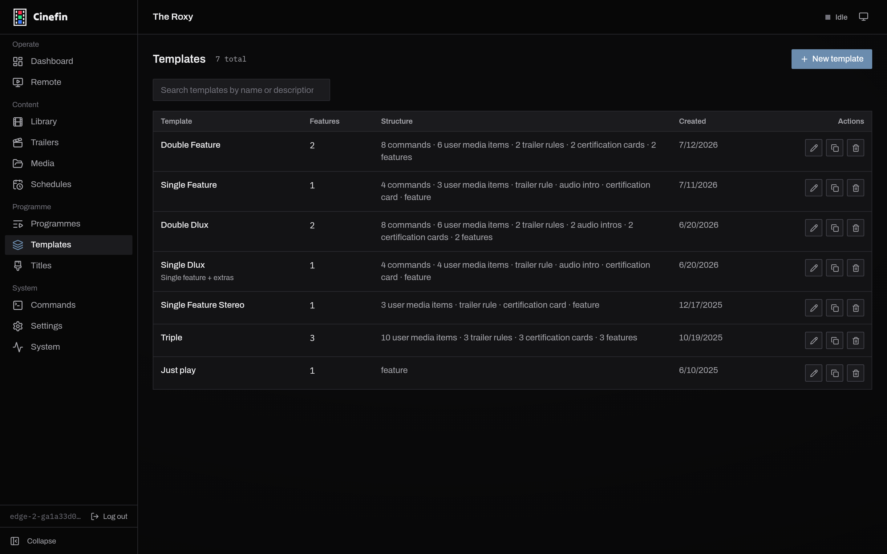
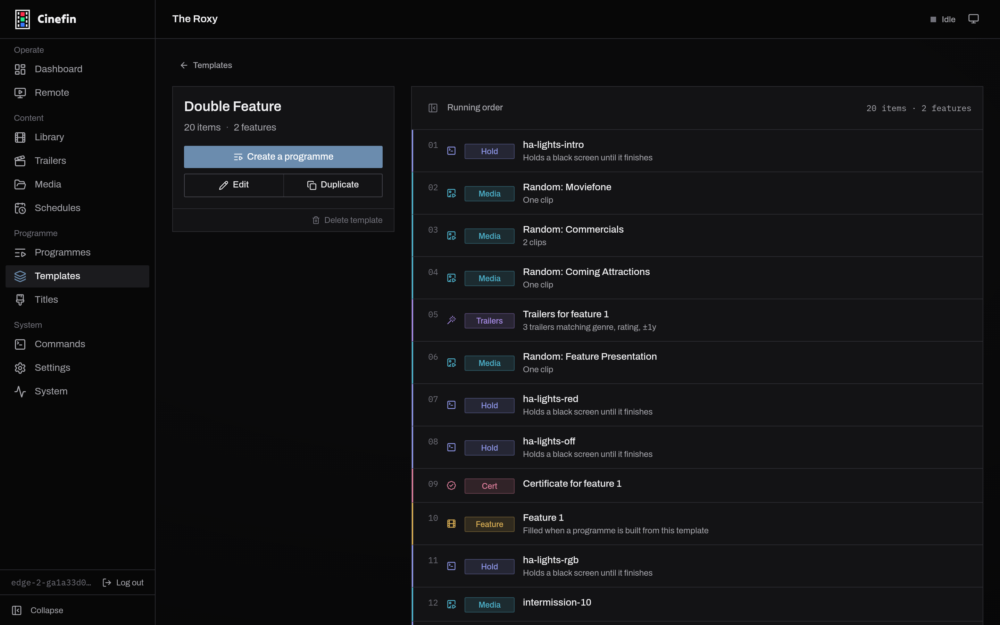
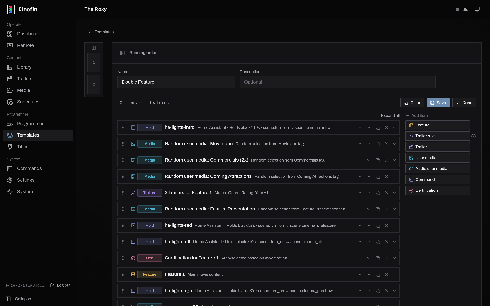

# Templates

A template is the reusable shape of a screening. It is an ordered running order
of blocks - idents, trailer rules, a certification card, the feature, lighting
commands - with the specifics left open. You build a [programme](programmes.md)
from a template, and Cinefin fills in the real media at that point.

Design a "Double Feature" template once, and every double bill you run from it
comes out with the same rhythm: house lights, a couple of user media clips,
trailers matched to tonight's films, the certification cards, then the features.

## The templates list

Open **Templates** to see every template, how many features it schedules, and a
one-line summary of its structure.

<figure markdown="span">
  
  <figcaption>Each template with its feature count and structure.</figcaption>
</figure>

Use **New template** to start one, the search box to find one, and the row
actions to edit, **duplicate** (a good way to spin a variant off a template that
works), or delete.

## What a template looks like

Open a template to see its running order. Blocks that resolve at build time show
what they will become - a trailer rule reads "3 trailers matching genre, rating",
a random user media block reads "one clip", and each **Feature** block is a
placeholder "filled when a programme is built from this template".

<figure markdown="span">
  
  <figcaption>Feature blocks are placeholders; rules resolve when you build a programme.</figcaption>
</figure>

From here, **Create a programme** builds a real screening from the template,
**Edit** changes the template, and **Duplicate** copies it.

## Block types

Templates deal in *rules and placeholders*, not fixed media - the actual film is
chosen when you build the programme, not when you design the template.

| Block | What it does |
| --- | --- |
| Feature | A placeholder for a film, chosen when you build the programme |
| Trailer rule | Auto-selects trailers matched to a feature by genre, rating and year |
| Trailer | One specific trailer |
| User media | Your own clip - an ident or notice - either a specific one or a random pick from a tag |
| Audio user media | A short intro matched to a feature's audio format (a Dolby or DTS sting), chosen at build time |
| Command | A system action such as switching lights, run through Home Assistant, REST or a script |
| Certification | The rating card for a feature, generated at build time |

Most blocks refer to a feature by number ("for feature 1"), so they follow
whichever film lands in that slot when you build a programme.

## Feature slots

A template declares how many features it schedules - one for a single feature,
two for a double bill, and so on. Every **Feature** block fills one numbered
slot, and the templates list and detail page show the count ("2 features"). Add
a second Feature block, and the trailer, certification and audio-intro blocks
can each point at either film.

A Feature block can also carry a **credits command** - an action that fires when
the film reaches its closing credits, handy for bringing the house lights up as
the feature ends.

## Trailer rules

A trailer rule is the smart part of a template: it picks a fresh set of trailers
every time the playlist is generated, so a programme you rebuild next month pulls
in whatever trailers you have downloaded since. Expand the rule to set:

- **For feature** - which feature the trailers should suit.
- **Number of trailers** - how many to pull (default 3).
- **Match on** - any of **Genre**, **Rating** and **Year**. Genre and rating are
  on by default; year is off. Rating never picks a trailer rated above the
  feature; **Year tolerance (±)** sets how many years either side of the feature
  count as a match.
- **Tag** - restrict the pool to trailers with a given tag, or leave it as *Any*.

If fewer trailers match than you asked for, only the matches play and the rest of
the slot stays empty; if none match, nothing plays there.

## Commands

A **Command** block runs a [configured command](../reference/configuration.md) at
its point in the running order. It has two modes:

- **Instant** (the default) - the command fires invisibly as the show reaches
  that point, with nothing shown on screen.
- **Hold** - the screen holds black until the command finishes and its minimum
  duration has passed, then the show moves on. Use this to give a lighting or
  projector cue time to complete.

## Editing a template

**Edit** opens the same block editor used for programmes. Drag blocks by the grip
handle to reorder them (or select one and use **Alt + ↑ / ↓**), duplicate or
remove them, and add new ones from the **Add item** palette. Press **?** for the
full keyboard shortcuts.

<figure markdown="span">
  
  <figcaption>Arrange blocks and set each one's rules; the film comes later.</figcaption>
</figure>

Expand a block to set its rules - the tag a random user media block draws from, how many
trailers a rule pulls, whether a command holds a black screen while it runs.
**Save** keeps your changes; **Done** returns to the template. Editing a template
does not touch programmes you have already built from it.

## Title templates

A separate kind of template, on the **Titles** page, lays out the generated
**title card** shown before a feature - poster, title and metadata on a
1920x1080 canvas. Assign a title template to a programme from its **Title
screen** tab to replace the usual ident with a bespoke card for that film. Cinefin
ships several layouts (centred poster, side-by-side for double bills, and more)
that you can duplicate and adjust.
