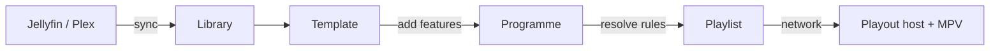

---
hide:
  - navigation
  - toc
---

Cinefin runs home cinema screenings from your own movie library. It builds a
show out of trailers, your own user media, a certification card and your movies.
It plays it back, and can trigger lights and print tickets while it does.

The Cinefin server plans and controls the show. Playback happens on a playout
host: the cinefin-playout agent, which is a shell around MPV, or a local MPV. It
can run on the same machine as the server, or on a separate one.

[Get started](getting-started/index.md){ .md-button .md-button--primary }
[User guide](guide/programmes.md){ .md-button }

## Features

-   :material-sync:{ .lg .middle } **Library sync**

    ---

    Pull movies and posters from Jellyfin or Plex. Syncs run in the background
    and can be scheduled.

    [:octicons-arrow-right-24: Library sync](guide/library-sync.md)

-   :material-filmstrip:{ .lg .middle } **Programmes**

    ---

    Build a screening from a template of trailers, user media, a certification
    card and the feature.

    [:octicons-arrow-right-24: Programmes](guide/programmes.md)

-   :material-calendar-clock:{ .lg .middle } **Scheduling**

    ---

    Book a screening for a date and time. The web app starts it when it is due.

    [:octicons-arrow-right-24: Scheduling](guide/scheduling.md)

-   :material-play-circle:{ .lg .middle } **Playout**

    ---

    Play, pause, skip and seek from any page. Each block can pin its own audio
    and subtitle track.

    [:octicons-arrow-right-24: Playback](guide/playback.md)

-   :material-api:{ .lg .middle } **REST API**

    ---

    Everything the web UI does is available over HTTP, with interactive docs
    built in.

    [:octicons-arrow-right-24: REST API](reference/api.md)

-   :material-docker:{ .lg .middle } **Runs anywhere**

    ---

    Install with Poetry and systemd, or run the web app in Docker.

    [:octicons-arrow-right-24: Installation](getting-started/installation.md)

## How it works

Cinefin has two halves. The **server** holds your library and plans the show; the
**playout host** (the [playout agent](guide/playback.md) running MPV, or a local
MPV) sits at the screen and plays it. They can be one machine or two.

The pieces fit together in one line:

1. **Sync** your movies from Jellyfin or Plex into the **library** (local files
   work too).
2. Design a **template** once: the running order of idents, trailers, a
   certification card and the feature, with the film left as a slot.
3. Build a **programme** from that template by dropping in tonight's feature.
   Cinefin resolves the trailer rules and any random picks into a fixed
   **playlist**.
4. **Cue** the programme and start it, now or on a **schedule**. The server drives
   the playout host through the show, and can trigger lights, print tickets and
   run other [commands](guide/commands-plugins.md) as it goes.

Between shows the screen holds your [System Ident](guide/system-ident.md), the
same clip that opens each programme.
