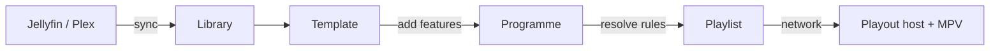

import Link from '@docusaurus/Link';
import {DocIndex, DocIndexRow} from '@site/src/components/DocIndex';

<header className="docs-hero">
  <h1>Cinefin Documentation</h1>
  

    Cinefin runs home cinema screenings from your own movie library. It builds a
    show out of trailers, your own user media, a certification card and your
    movies. It plays it back, and can trigger lights and print tickets while it
    does.
  

  

    <Link className="button button--primary" to="/getting-started/">Get started</Link>
    <Link className="button button--secondary" to="/guide/programmes/">User guide</Link>
  

</header>

The Cinefin server plans and controls the show. Playback happens on a playout
host: the cinefin-playout agent, which is a shell around MPV, or a local MPV. It
can run on the same machine as the server, or on a separate one.

## In these docs

<DocIndex>
  <DocIndexRow n="01" title="Installation" to="/getting-started/installation/" section="setup">
    Run the server with Docker or pipx, then connect a player.
  </DocIndexRow>
  <DocIndexRow n="02" title="Library sync" to="/guide/library-sync/" section="guide">
    Pull movies and posters from Jellyfin or Plex. Syncs run in the background
    and can be scheduled.
  </DocIndexRow>
  <DocIndexRow n="03" title="Templates" to="/guide/templates/" section="guide">
    The reusable shape of a screening: trailer rules, user media, the
    certification card and feature slots.
  </DocIndexRow>
  <DocIndexRow n="04" title="Programmes" to="/guide/programmes/" section="guide">
    Build a screening from a template and review its fixed playlist.
  </DocIndexRow>
  <DocIndexRow n="05" title="Scheduling" to="/guide/scheduling/" section="guide">
    Book a screening for a date and time. The web app starts it when it is due.
  </DocIndexRow>
  <DocIndexRow n="06" title="Playback" to="/guide/playback/" section="guide">
    The playout agent, local MPV, and the remote. Each block can pin its own
    audio and subtitle track.
  </DocIndexRow>
  <DocIndexRow n="07" title="REST API" to="/reference/api/" section="reference">
    Everything the web UI does is available over HTTP, with interactive docs
    built in.
  </DocIndexRow>
</DocIndex>

## How it works

Cinefin has two halves. The **server** holds your library and plans the show; the
**playout host** (the [playout agent](guide/playback.mdx) running MPV, or a local
MPV) sits at the screen and plays it. They can be one machine or two.

The pieces fit together in one line:

1. **Sync** your movies from Jellyfin or Plex into the **library** (local files
   work too).
2. Design a **template** once: the running order of idents, trailers, a
   certification card and the feature, with the film left as a slot.
3. Build a **programme** from that template by dropping in tonight's feature.
   Cinefin resolves the trailer rules and any random picks into a fixed
   **playlist**.
4. **Cue** the programme and start it, now or on a **schedule**. The server drives
   the playout host through the show, and can trigger lights, print tickets and
   run other [commands](guide/commands-plugins.md) as it goes.

Between shows the screen holds your [System Ident](guide/system-ident.md), the
same clip that opens each programme.
